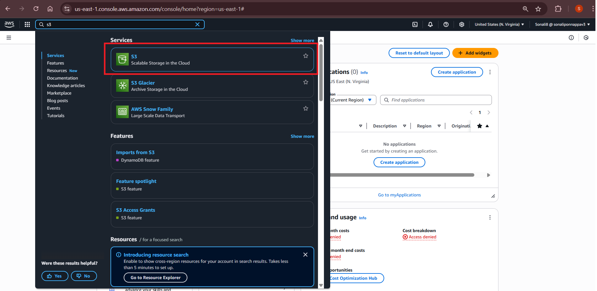

# AWS Lab: Host a Static Website on Amazon S3

**Lab Duration**: 20–30 minutes  
**Skill Level**: Beginner  
**AWS Service Used**: Amazon S3  

---

## Lab Overview

Amazon S3 (Simple Storage Service) allows you to store and retrieve any amount of data, anytime, from anywhere on the web. In this lab, you will host a static website by uploading your HTML and CSS files to an S3 bucket, enabling static website hosting, and setting the correct permissions.

---

## Lab Objectives

- Create an S3 Bucket
- Upload HTML/CSS Files to S3
- Enable Static Website Hosting
- Set Bucket Permissions
- Access the Website via a Public URL

---

## Prerequisites

- AWS account
- Basic knowledge of web development (HTML/CSS)
- Access to the AWS Management Console

---

## Task 1: Create an S3 Bucket

### Step 1: Log In to AWS
- Go to the [AWS Management Console](https://console.aws.amazon.com/).
- In the **Search bar**, type **S3** and select **S3** under services.

### Step 2: Create a Bucket
- Click on **Create bucket**.
- Enter the following details:
  - **Bucket Name**: `your-unique-bucket-name` (must be globally unique).
  - **Region**: Select your preferred AWS region (e.g., `US East (N. Virginia)`).
- Click **Create**.

*Insert Image: S3 Create Bucket Page Here*

---

## Task 2: Upload HTML/CSS Files to the Bucket

### Step 1: Upload Files
- After creating the bucket, click on the **Bucket Name**.
- Click on the **Upload** button.
- Drag and drop your `index.html` and `styles.css` files into the S3 bucket.
- Click **Upload** to complete the process.

*Insert Image: S3 Bucket File Upload Section Here*

---

## Task 3: Enable Static Website Hosting

### Step 1: Enable Static Website Hosting
- Go to the **Properties** tab of your bucket.
- Scroll down to **Static website hosting** and click on **Edit**.
- Select **Enable**.
- For the **Index document**, enter `index.html` (or the name of your homepage file).
- Optionally, enter an **Error document** (e.g., `error.html`).
- Click **Save changes**.

*Insert Image: Static Website Hosting Settings Here*

---

## Task 4: Set Bucket Permissions

### Step 1: Set Bucket Permissions
- Go to the **Permissions** tab of your bucket.
- Under **Block public access**, click on **Edit** and uncheck the box for **Block all public access**.
- Acknowledge the warning by typing `confirm` and click **Save changes**.

*Insert Image: Bucket Permissions Settings Here*

---

## Task 5: Access the Website

### Step 1: Get Website URL
- Go back to the **Properties** tab of your bucket.
- Scroll down to **Static website hosting**.
- Copy the **Website endpoint URL**.

### Step 2: Open Your Site
- Paste the URL into your browser — your static website should now be live!

*Insert Image: Static Website Endpoint URL Here*

---

## Notes

- Your `index.html` file must be at the root of the bucket (not inside any folder).
- Bucket names must be unique across AWS.
- Use lowercase letters and hyphens in the bucket name.
- Never add sensitive or private files to a public bucket.

---

## Validation Check

- Navigate to the **Website endpoint URL** and verify that your static website is live.

---

### Summary

In this lab, you successfully created an S3 bucket, uploaded your website files, enabled static website hosting, set the correct permissions, and accessed your live static website via a public URL.

---

### Reference Links
- [AWS S3 Documentation](https://docs.aws.amazon.com/s3/index.html)
- [How to Host a Static Website on S3](https://docs.aws.amazon.com/AmazonS3/latest/userguide/WebsiteHosting.html)

---
